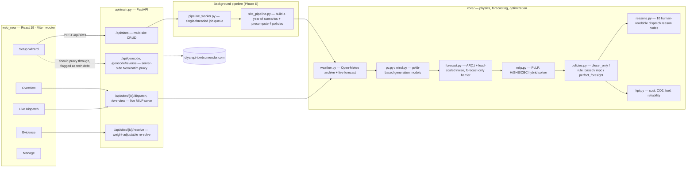

# DIYA — Dispatch Intelligence for Yield & Autonomy

**A forecast-aware dispatch brain for off-grid microgrids — built to prove, hour by hour, that a real-time optimizer beats a rule of thumb, and to explain in plain language why it chose what it chose.**

DIYA takes a solar/wind/battery/diesel hybrid microgrid — currently modeling a real off-grid site at **Khavda, Kutch, Gujarat, India**, serving a health centre (critical load), household/business demand (essential load), and an RO water plant / flour mill (deferrable load) — and answers one question every hour: *given what the weather is about to do, what should this system run right now, and why?*

It is not a simulation toy. Every number quoted below comes from a real MILP solve against real historical weather, and every UI claim in this README was captured against a live, running instance — not retyped from memory.

---

## The headline result

On **S2**, a real monsoon-stretch week at Khavda, four policies were run against the exact same weather and load:

| Policy | Diesel (L) | Total cost (INR) | CO₂ (kg) | Renewable share | Generator starts |
|---|---:|---:|---:|---:|---:|
| `diesel_only` (no renewables used) | 945.48 | 96,948.32 | 2,533.90 | 0% | 1 |
| `rule_based` (naive if/else baseline) | 568.25 | 56,933.76 | 1,522.90 | 46.4% | 7 |
| **`mpc` (DIYA's forecast-aware optimizer)** | **403.08** | **41,754.76** | **1,080.25** | **56.7%** | 13 |
| `perfect_foresight` (theoretical ceiling — knows the future) | 287.18 | 32,765.89 | 769.66 | 62.9% | 9 |

Critical-load outage hours are **0.0 for every policy** on this scenario — the story here is fuel/cost/CO₂ efficiency, not reliability risk.

**`mpc` captures 62.8% of the entire theoretical gap** between the naive baseline and the unattainable perfect-foresight ceiling — using nothing but a rolling weather forecast and a MILP solver, not knowledge of the future. That number is DIYA's entire thesis in one line: *forecast-aware beats rule-based, by a wide and provable margin, without cheating.*

---

## Architecture



**The physical chain, end to end:** raw hourly weather (Open-Meteo) → PV/wind power curves (`pvlib` + a hand-derived cubic wind curve) → an AR(1)-plus-lead-scaled-noise forecast model that never lets the optimizer see the truth early → a mixed-integer linear program that decides battery charge/discharge and diesel commitment hour by hour → a plain-English reason attached to every single decision.

---

## The build, phase by phase

This wasn't written in one pass. It was built, frozen, demoed, generalized, and then hardened against real bugs surfaced by real usage — eighteen shipped phases, each with its own acceptance bar:

| Phase | What it shipped |
|---|---|
| **0** | Repo scaffolding, Pydantic v2 contracts, deterministic mock data generator |
| **1A** | Real weather ingestion (Open-Meteo), `pvlib`-based PV model, a from-scratch cubic wind power curve, synthetic load generation, the AR(1) forecast model |
| **2** | The MILP dispatch engine itself — toy-instance tests that hand-verify the optimizer against arithmetic a human can check, plus invariant tests (energy balance, SOC bounds never violated) |
| **3** | The simulator, all four dispatch policies, the reason-code engine, the KPI calculator, the run orchestrator — real precomputed runs for the first time |
| **1B** | The first web shell — a control-room UI built directly against real Phase 3 run data, not mocks |
| **4** | Live-solve and weight-adjustable re-solve endpoints, wired into an "Operator Live" view and an Evidence stress-test panel |
| **5** | One-command startup (`run_demo.py`), an offline smoke test, freeze notes with real headline numbers pulled from disk, not memory |
| **6** | A full UI redesign — new information architecture, restyled chart hierarchy — with zero data or schema changes underneath |
| **B** | Solver swap: CBC subprocess → HiGHS in-process, chosen and *bounded* by empirical benchmarking, not assumption (see below) |
| **C** | Generalized the entire backend from "Khavda, hardcoded" to a real multi-site store — site-scoped routes, legacy routes preserved byte-for-byte |
| **C.5** | Auto-generated OpenAPI contract + human-readable `API_CONTRACT.md`, Render deployment prep |
| **C.6** | Server-side geocoding proxy (Nominatim policy compliance), and convenience endpoints (`overview`, `dispatch`, `evidence`, `export`, `methodology`) that compose existing logic into frontend-friendly shapes |
| **E** | A generalized background-job pipeline: any newly created site gets a real year of historical scenarios and all four policies precomputed automatically, on a single-threaded worker queue sized for a free-tier host |
| **Bugfix-1** | Root-caused and fixed three real multi-site correctness bugs (see below) surfaced by testing a live, newly created site end to end |
| **SWAP-1** | Rigorous verification of an externally-built React frontend against the live backend — endpoint-by-endpoint contract audit, live smoke tests, real site creation through the actual wizard — before it was allowed to become the primary UI |
| **Bugfix-2** | Root-caused a live-weather caching bug that could leak one site's forecast into another's response, fixed it with real reproduction data, added deterministic regressions for both the caching mechanism and the underlying symptom |

Every phase followed the same discipline: **investigate and confirm the real cause with real reproduction data before writing a fix.** Several "obvious" theories were tested and rejected along the way (see the war stories below) — that discipline is arguably the actual product here, not any one line of code.

---

## Engineering decisions worth knowing about

### The forecast can never see the future — enforced, not just documented
`core/forecast.py` states one rule in its module docstring: *the optimizer may ONLY ever see the output of `make_forecast`.* Any code path that leaks realized weather into the solver is treated as a bug, with exactly one named, deliberate exception: `perfect_foresight`, whose entire purpose is to be the unfair upper bound the other three policies are honestly measured against.

### A solver choice backed by a benchmark, not a hunch
Phase B swapped the dispatch engine's solver backend from `PULP_CBC_CMD` (a subprocess shelling out to `cbc.exe` on every single hourly solve) to PuLP's in-process HiGHS binding. The obvious assumption — "the newer in-process solver is faster, use it everywhere" — turned out to be **half wrong**, and the codebase says so out loud:

- On perfect_foresight's one large 168-hour, ~336-binary MILP: HiGHS wins by **~7x** (30.1s → 4.3s).
- On the *many small* 24-hour MILPs that `run_mpc`'s rolling loop solves one per hour: CBC is consistently **faster** than HiGHS, despite its subprocess overhead (198ms vs. 686ms mean).

So `core/milp.py` routes by horizon length (`HIGHS_MIN_HORIZON_HOURS = 100`), verified against `scripts/benchmark_solver.py`'s real numbers rather than shipped on intuition. This is also why `/api/resolve`'s ~60-65 second response time is disclosed in `FREEZE_NOTES.md` as an *accepted, understood* cost rather than a silently-eaten regression — the honest fix (a warm-started persistent solver across the rolling loop) is a real future phase, not a quick patch.

### Explainability as a first-class output, not a debug log
Every dispatch step carries a `reason_code` from a fixed set of ten (`R0_NOMINAL` through `R9_DIESEL_ONLY`) and a `reason_text` template rendered with the *site's own* vocabulary — Khavda's health centre is "critical load," another site's might be labeled differently, and the same reason engine renders correctly for both because the label is a config field, not a hardcoded string.

### Multi-site generalization, done as an actual refactor
Phase C didn't bolt multi-site support on top — it extracted khavda's own hardcoded behavior into the general case, then verified the general case reproduces khavda's exact original behavior byte-for-byte. Phase E's background pipeline (a single-threaded job queue, deliberately not one-thread-per-site, because a free-tier host's shared CPU can't survive concurrent 168-solve backfills) means creating a new site through the Setup Wizard gets it a full year of real historical scenarios and all four precomputed policies with zero manual steps.

### Two real bug hunts, told straight

**Bugfix-1** — a newly created site showed nonzero wind output despite having no wind turbine, and reason text that awkwardly said "critical load" for every site regardless of what it actually served. Root cause, confirmed with a live throwaway site and a hand-verified MILP toy instance: a reserve constraint in `core/milp.py` wasn't gated on whether diesel was actually enabled, and the rule-based/diesel-only policies had phantom generator-start bookkeeping. Fixed at the source, with a new regression test that asserts zero generator starts across *all four* policies for a diesel-less site — which caught a *second*, previously-unknown instance of the same bug while writing that very test.

**Bugfix-2** — two sites on opposite sides of the planet were reported showing identical solar and wind forecasts, and a no-wind site was again showing nonzero wind. Investigation before any fix: created two real sites (Gujarat and New York), forced a live-fetch failure, and proved with the raw cached JSON's own echoed coordinates that the fallback cache was a *single fixed file shared by every site on the deployment* — whichever site's fetch failed last simply inherited whoever fetched successfully most recently, regardless of location. A second, deeper layer of the same bug: the *final* fallback tier replayed Khavda's own precomputed scenario data verbatim for any site, hardware mismatch and all. Both fixed by keying the cache to (lat, lon) and by making the last-resort fallback replay the *requesting* site's own data — with khavda's own behavior left provably byte-identical throughout.

---

## Tech stack

| Layer | Choice | Why |
|---|---|---|
| Optimization | PuLP, HiGHS (in-process) with a CBC fallback | Empirically routed by horizon size (see above); HiGHS via `highspy` needs no subprocess or system solver install |
| Physics | `pvlib`, a hand-written cubic wind power curve | `pvlib` for validated solar-position/irradiance modeling; wind has no equivalent standard library, so the curve is implemented and unit-tested directly |
| Backend | FastAPI + Pydantic v2 | Contracts are the same models that generate `docs/openapi.json` — the human-readable contract can never drift silently from the real request/response shapes |
| Data | pandas, pyarrow (Parquet), PyYAML | Scenario weather/load series as Parquet; site/scenario config as readable, diffable YAML |
| Frontend | React 19, Vite 7, TypeScript, wouter, Recharts, Leaflet, Radix UI, Tailwind CSS 4 | A from-scratch rebuild (`web_new/`), verified endpoint-by-endpoint against the live backend before replacing the original Phase 1B/6 shell |
| Weather | Open-Meteo (archive + forecast APIs) | No API key required, generous free tier, both a historical-backtest endpoint and a live-forecast endpoint from the same provider |
| Geocoding | OpenStreetMap Nominatim, proxied server-side | Nominatim's usage policy requires a real User-Agent header browsers cannot set — `core/geocode.py` is the one place in the codebase allowed to call it |
| Deployment | Render (API), Cloudflare Pages (frontend, static) | The frontend is a pure SPA hitting an absolute external API URL with open CORS — no server runtime needed on the frontend side at all |

---

## API surface

24 routes across five groups (full request/response shapes, real captured examples, and error cases for every one of them live in `docs/API_CONTRACT.md`, auto-generated by `scripts/generate_api_contract.py` — never hand-edited):

- **Service** — `GET /`, `/api/health`
- **Sites** — `GET/POST /api/sites`, `GET/PATCH/DELETE /api/sites/{id}`, `.../pipeline_status`, `.../rebuild`
- **Dispatch & solving** — `.../dispatch` (auto/live/precomputed source control), `.../solve_live`, `.../resolve` (weight-adjustable), `.../scenarios`, `.../runs`
- **Insight** — `.../overview`, `.../evidence`, `.../export`, `GET /api/methodology`
- **Geocoding** — `POST /api/geocode`, `/api/geocode/reverse`

---

## Running it

```bash
# Backend
pip install -r requirements.txt
python scripts/build_scenarios.py      # once, or after a config change
python scripts/precompute_runs.py      # once, or after a config change
python scripts/smoke_test.py           # verify everything is intact
uvicorn api.main:app --reload          # http://localhost:8000

# Frontend (separate terminal)
cd web_new
pnpm install                           # not npm — this repo pins pnpm and a pnpm-only patch
pnpm run build
PORT=4173 NODE_ENV=production node dist/index.js   # http://localhost:4173
```

Or, for the backend + a Vite dev server together: `python scripts/run_demo.py` — starts both, waits for both to report healthy, prints their URLs, and cleanly stops both (no orphaned processes) on Ctrl+C.

`web_new`'s API base is a hardcoded absolute URL pointing at the live Render deployment by default, so it shows real data immediately with zero local backend required.

---

## Testing philosophy

**123 tests**, and a deliberate stance on what "real" testing means here: tests that exercise `/api/solve_live` and the live-forecast fallback chain hit the *real* Open-Meteo network, on the theory that a mocked weather response can't catch a real API shape change or a real timeout. The cost is accepted openly — the live-network test suite is documented to run in minutes, not seconds — rather than mocked away for a faster, less honest green checkmark.

Golden KPI tests carry a documented, narrow tolerance band for one specific, understood cause: HiGHS and CBC can both find equally-optimal but numerically different solutions on an underconstrained dimension of the perfect-foresight problem (`tests/test_golden_kpis.py`'s `_SOLVER_TIEBREAK_FIELDS`) — the deterministic policies (`mpc`, `rule_based`, `diesel_only`) carry no such tolerance, because there's no excuse for those drifting.

Every phase that touched shared logic re-verified Khavda's precomputed data was **byte-identical** afterward — not "close enough," an actual diff against the committed run JSON.

---

## Known, disclosed limitations

- `/api/resolve`'s full 168-hour re-solve takes ~60-65 seconds — understood and explained above, not a bug, and not yet fixed (needs a warm-started persistent solver, a candidate future phase).
- Render's free tier has no persistent disk: a site created via `POST /api/sites` survives until the next deploy/restart, then is gone. Fine for demos, not yet a durable multi-tenant store.
- Render's free tier cold-starts after ~15 minutes idle — the first request after a lull can take 30-60 seconds.
- CORS is deliberately wide open (`allow_origins=["*"]`) for ease of frontend integration during active development — closing this is a named future phase, not an oversight.
- The Setup Wizard's location search currently calls Nominatim directly from the browser rather than through the backend's compliant proxy — a known, flagged gap pending its own fix.

Nothing above is hidden in a demo; it's exactly what `FREEZE_NOTES.md` and `DEPLOYMENT.md` say to expect.

---

## Repo layout

```
core/            physics, forecasting, optimization, policies, KPIs, reasons — the actual brain
api/main.py      FastAPI app: multi-site CRUD, live/precomputed dispatch, evidence, geocoding
config/          site + scenario YAML — human-readable, diffable, provenance-commented
data/            cached weather, built scenarios (Parquet), precomputed policy runs (JSON)
sites/           per-site registry + generated config/scenarios/runs for non-seed sites
scripts/         build_scenarios, precompute_runs, smoke_test, run_demo, benchmark_solver,
                 generate_api_contract
tests/           123 tests — contracts, MILP invariants, golden KPIs, live endpoints,
                 multi-site pipeline, weather-caching regressions
web_new/         React 19 / Vite / TypeScript frontend — Setup, Overview, Live Dispatch,
                 Evidence, Manage
docs/            auto-generated API_CONTRACT.md + openapi.json — never hand-edited
FREEZE_NOTES.md  headline numbers and a pre-demo checklist, pulled from real output
DEPLOYMENT.md    Render deployment guide, disclosed limitations of the live deployment
```

---

*Weather is real historical/live data. Economics are configurable assumptions — not utility bills. Every claim above is checkable against the code and the data in this repository.*
